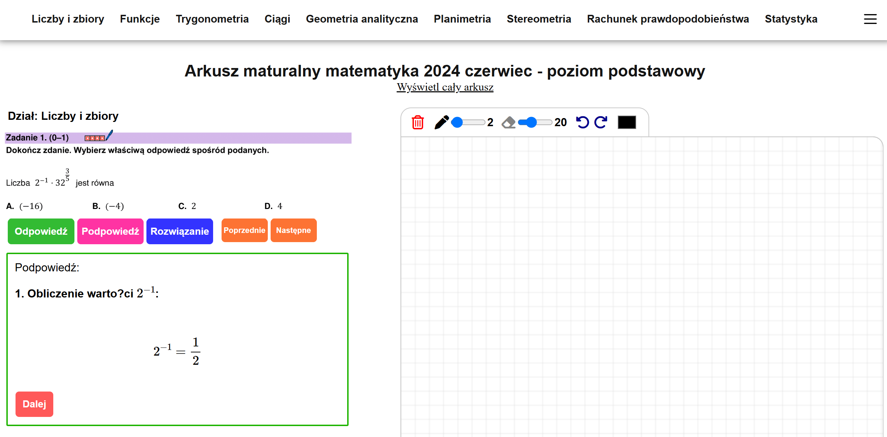

# EzMaturka

**EzMaturka** to interaktywna platforma edukacyjna, która umożliwia uczniom przygotowanie się do egzaminu maturalnego z matematyki na poziomie podstawowym. Strona zawiera intuicyjny interfejs, zestaw zadań, podpowiedzi oraz rozwiązania krok po kroku.

<h2>Funkcjonalności</h2>

1. **Kategorie tematyczne**  
   Strona jest podzielona na sekcje tematyczne, takie jak:  
   - Liczby i zbiory  
   - Funkcje  
   - Trygonometria  
   - Ciągi  
   - Geometria analityczna  
   - Planimetria  
   - Stereometria  
   - Rachunek prawdopodobieństwa  
   - Statystyka  

2. **Rozwiązywanie zadań**  
   - Zadania są przedstawione w prosty i przejrzysty sposób.  

3. **Podpowiedzi i rozwiązania**  
   - Dostępne są podpowiedzi prowadzące krok po kroku do rozwiązania.  
   - Możliwość przeglądania pełnych rozwiązań z wyjaśnieniami. 

4. **Panel użytkownika**  
   - Intuicyjne przyciski do poruszania się po zadaniach: "Poprzednie", "Następne".  
   - Możliwość natychmiastowego sprawdzania poprawności.

5. **Notatnik matematyczny**  
   - Użytkownik ma dostęp do pola rysunkowego, które pozwala wykonywać obliczenia lub rysunki geometryczne.  

<h2>Jak uruchomić projekt?</h2>

1. Pobierz projekt: Sklonuj repozytorium lub pobierz paczkę ZIP z projektem.
2. Uruchom XAMPP.
3. Włącz serwer Apache i MySQL w panelu XAMPP.
4. Zainstaluj bazę danych do phpmyadmin pod nazwą "matura".
5. Umieść folder projektu w katalogu htdocs.
3. Uruchom aplikację w przeglądarce: Otwórz przeglądarkę i przejdź pod adres: http://localhost/nazwa_katalog_projektu

<h2>Zrzut ekranu</h2>

Zadanie przykładowe:  

<h2>Technologie</h2>

Strona została zaprojektowana z użyciem:  
- HTML, CSS, JavaScript, PHP, MySQL

Bibliotek:  
- MathJax
- Font Awesome
- JQuery

<h2>Kontakt</h2>

Jeśli masz pytania lub sugestie, skontaktuj się ze mną:  
**E-mail:** kontakt@ezmaturka.pl  
**Github:** Proxuu  
